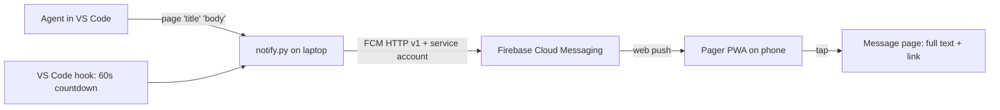

# Agent Pager

Lets a coding agent (GitHub Copilot, Claude Code) send a push notification to your phone when it
is blocked on you: an approval prompt, a sign-in code, a question, or a long job that finished.
Tap the notification to read the full message.

No native app, no paid developer account, and no paid cloud plan:

- The phone side is a one-page PWA on Firebase Hosting. On iPhone you add it to the home screen once.
- Messages go through Firebase Cloud Messaging (free).
- The sender is a small Python CLI on your laptop.



## How the agent decides to page you

The agent can't page you once an approval prompt is on screen, because it is paused waiting for you.
So there are two paths:

| Situation | Who pages |
|---|---|
| A quick tool (read/edit/search files, fetch a page, ask a question) waits on a confirmation for 60s | The VS Code hook. These tools finish in about a second, so 60s pending means blocked. |
| A terminal command or MCP tool that will need approval | The agent, just before calling it ([skill/SKILL.md](skill/SKILL.md)) |
| A command prints a device-login code or opens an SSO tab | The agent, as soon as it sees it |
| A long job the user is waiting on finishes or fails | The agent |

Terminal and MCP tools are left out of the hook on purpose. They can run for many minutes, so a
timer would give false alarms.

## Setup

You need: a Google account, Python 3, Node 18+ (only for deploying), and an iPhone on iOS 16.4+
(Android Chrome also works).

### 1. Firebase project (console.firebase.google.com)

1. Create a project. Google Analytics and Gemini are not needed. The free Spark plan is enough.
2. Project settings -> General -> Your apps -> add a **Web** app. Copy its config into
   [web/config.js](web/config.js).
3. Project settings -> Cloud Messaging -> Web Push certificates -> **Generate key pair**. Put the
   public key in `VAPID_KEY` in `web/config.js`.
4. Project settings -> Service accounts -> **Generate new private key**. Move the downloaded file
   into the repo folder (after cloning in step 2):

   ```bash
   mv ~/Downloads/<project>-firebase-adminsdk-*.json service-account.json
   chmod 600 service-account.json
   ```

   This key can send messages as your project. `.gitignore` excludes it; never force-add it.
   To keep it elsewhere, set `AGENT_NOTIFY_KEY=/path/to/key.json`.
5. Lock down the public web API key so nobody else can use your project's quota with it.
   Google Cloud console -> APIs & Services -> Credentials -> "Browser key (auto created by Firebase)":
   - Application restrictions: **Websites**, add `https://<project-id>.web.app/*` and
     `https://<project-id>.firebaseapp.com/*`.
   - API restrictions: **Restrict key**, keep only **FCM Registration API** and
     **Firebase Installations API** (the only two the PWA calls). Click OK, then Save.

   Sending is unaffected: `notify.py` authenticates with the service account, not this key.

### 2. Install on the laptop

```bash
git clone https://github.com/Nithanaroy/agent-pager-tool.git ~/Projects/agent-pager-tool
cd ~/Projects/agent-pager-tool
./install.sh
```

### 3. Deploy the PWA

The service-account key can deploy, so no separate `firebase login` is needed:

```bash
GOOGLE_APPLICATION_CREDENTIALS=service-account.json \
  npx -y firebase-tools@latest deploy --only hosting --project <project-id> --non-interactive
```

### 4. Phone

1. Open `https://<project-id>.web.app` in Safari -> Share -> **Add to Home Screen**.
2. Open **Pager** from the home screen -> **Allow notifications**.
3. Open "Device token", tap **Share**, and get the token to your laptop. Then:

   ```bash
   .venv/bin/python notify.py register '<token>' --name iphone
   ~/.config/agent-notify/page 'Hello' 'First test from the laptop'
   ```

### 5. VS Code

Auto-approve the page command so the agent never blocks on paging you. In `settings.json`:

```jsonc
"chat.tools.terminal.autoApprove": {
  "/^(~|\\/Users\\/<you>)\\/\\.config\\/agent-notify\\/page\\s/": true
}
```

Start a new chat session so VS Code loads the hook. To check, run **Chat: Configure Hooks** and
look for `agent-pager.json`.

#### The 60s countdown hook

`install.sh` sets it up for you. It fills in [hooks/agent-pager.template.json](hooks/agent-pager.template.json)
with the absolute path of your clone and writes the result to `~/.copilot/hooks/agent-pager.json`,
which VS Code loads for every workspace. The repo only holds the template, so nobody's personal
paths get committed.

To set it up by hand instead, replace `__REPO__` with your clone's absolute path:

```bash
mkdir -p ~/.copilot/hooks
sed "s|__REPO__|$PWD|g" hooks/agent-pager.template.json > ~/.copilot/hooks/agent-pager.json
```

To scope it to one project instead of all of them, put the same file in that project's
`.github/hooks/` folder. To turn it off, delete `~/.copilot/hooks/agent-pager.json`.

The hook reacts to four events: `PreToolUse` starts a 60s timer for quick tools,
`PostToolUse` cancels it when the tool finishes, and `Stop` and `UserPromptSubmit` clear any leftover
timers. Timers and a log live in `~/.config/agent-notify/` (`pending/`, `agent-notify.log`).

## Usage

```bash
~/.config/agent-notify/page 'TITLE' 'BODY' [--link 'https://...'] [--device NAME]
```

- The lock screen shows the first ~180 characters. Tapping opens the full body (up to ~2 KB) with
  an "Open link" button.
- The full message travels in the URL fragment (`#m=...`), which browsers don't send to the web
  server. It does pass through Google's and Apple's push services, so don't page secrets.
- `AGENT_NOTIFY_WAIT_SECS` changes the hook's 60s countdown.

## Files

| Path | What |
|---|---|
| `notify.py` | Sender CLI (`send`, `register`) and the hook entrypoint (`hook`) |
| `page` | Short wrapper for `notify.py send`, linked at `~/.config/agent-notify/page` |
| `install.sh` | Sets up the venv, links, and the hook config |
| `hooks/agent-pager.template.json` | VS Code hook config template (`install.sh` fills in the path) |
| `skill/SKILL.md` | Agent skill: when and how to page. Put machine-specific notes in `skill/local.md` (gitignored) |
| `web/` | The PWA: page, service worker, manifest, Firebase web config |

## Limitations

- Organizations can turn off VS Code hooks (`chat.useHooks` shows as managed by your
  organization). Then the 60s countdown never runs, and turning on `chat.useClaudeHooks`
  may not help either. Paging still works through the skill, where the agent pages you
  before a blocking step. To check whether the hook runs at all, look for
  `~/.config/agent-notify/last-event.json`: the hook updates it on every event.
- The hook only knows a tool is pending, not why. 60s is a safe bet for quick tools only.
- VS Code's Local agent has no "permission prompt shown" hook event. Copilot CLI has one
  (`notification` with `notification_type: permission_prompt`), which could replace the
  countdown there.
- iOS removes push permission if a push arrives and nothing is shown. FCM `notification`
  messages are always shown, so this doesn't happen here.
- If sends start failing with 404 UNREGISTERED, the phone's token changed: open Pager, re-share
  the token, and register it again.
